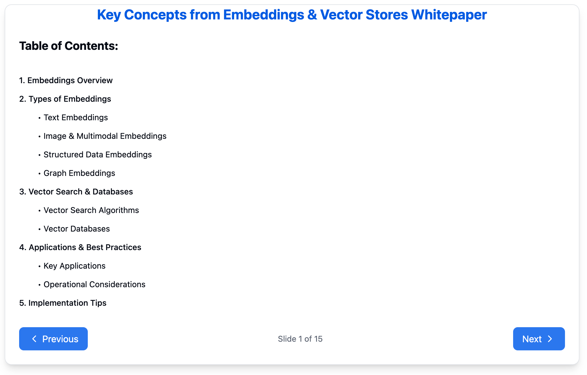
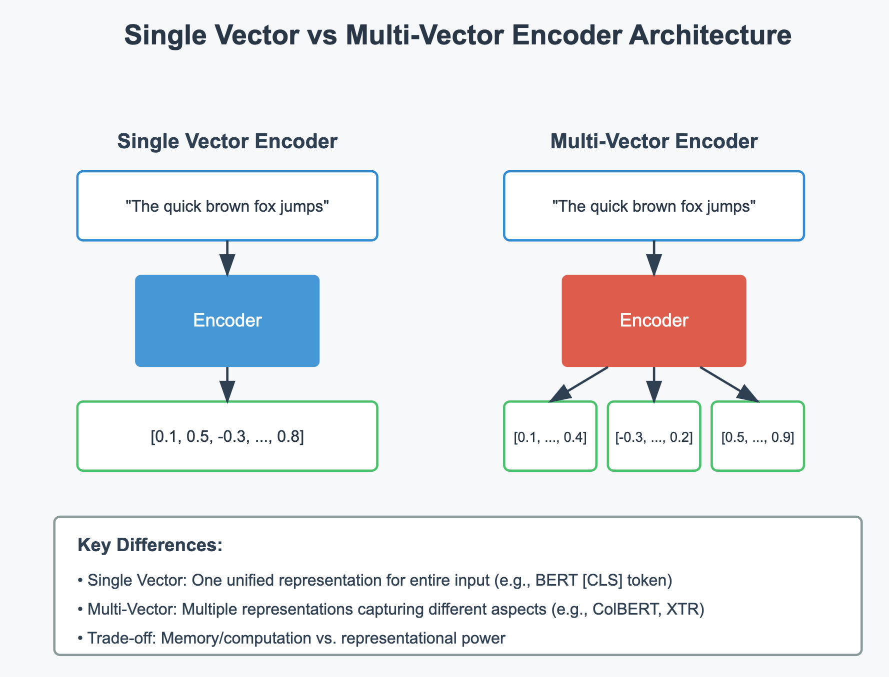
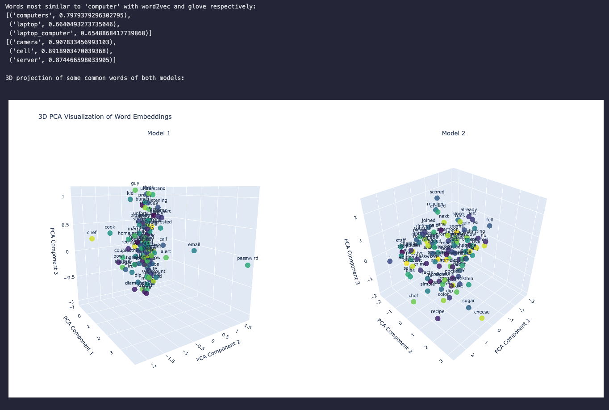

## Day 2 - Gemini API with Embeddings and Vector Stores

## Overview

This notebook introduces learners to embeddings, vector stores, and their applications using Google's Gemini API. Part of a comprehensive 5-day Generative AI course, Day 2 explores practical implementations of embedding-based solutions through hands-on examples.

## Main Topics Covered

### 1. Embeddings and Similarity Scores

- **Embedding Generation**: Using Gemini API's embedding endpoint
- **Similarity Calculations**: Computing and visualizing semantic similarities
- **Task Types**: Understanding different embedding tasks (semantic similarity, classification, retrieval)
- **Practical Applications**: Text comparison and similarity analysis
- **Visualization**: Creating heatmaps to understand embedding relationships

### 2. Classification with Embeddings

- **Model Architecture**:
  - Using Keras for embedding-based classification
  - Neural network design for embedding inputs
  - Output layer configuration for multi-class prediction
- **Data Processing**:
  - Converting text to embeddings
  - Handling newsgroup dataset
  - Preprocessing and cleaning techniques
- **Training Pipeline**:
  - Model compilation and training
  - Early stopping implementation
  - Performance evaluation
- **Custom Predictions**:
  - Making predictions on new text
  - Interpreting classification results

### 3. Document Q&A with RAG

- **RAG Implementation**:
  - Understanding the three stages: Indexing, Retrieval, Generation
  - Setting up ChromaDB for vector storage
  - Creating embedding functions for documents and queries
- **Vector Database Operations**:
  - Document indexing and storage
  - Similarity search implementation
  - Query processing and retrieval
- **Generation Process**:
  - Prompt construction with retrieved content
  - Response generation using Gemini
  - Answer formatting and presentation

## Best Practices

- Use appropriate task types for different embedding purposes
- Implement proper error handling for API calls
- Test embeddings with various similarity thresholds
- Monitor model performance and embedding quality
- Consider batch processing for large datasets

## Additional Resources & References

- **Documentation & Learning**:

  - [Embeddings & Vector Stores Whitepaper](https://www.kaggle.com/whitepaper-embeddings-and-vector-stores). This whitepaper has been summarized and turned into Claude artifact. Recommended to read before reading the whitepaper: https://claude.site/artifacts/c263104b-2f6f-45cd-aac1-592e81e138a2:

  { width=50% }

  - Understanding difference between Single Vector vs. Multi-Vector Encoder Architecture visually: https://claude.site/artifacts/2b20d783-f500-419f-a987-a16508a9839b
    { width=50% }

  - Visualized Word Embeddings in 3-D Space. Checkout the notebook to run: `word_embedding_visualization_3d.ipynb`
    

  - Comprehensive Gemini API documentation
  - Vector store implementation guides
  - ChromaDB documentation

- **Practical Tools**:
  - ChromaDB for vector storage
  - Keras for model building
  - Seaborn for visualization
  - Pandas for data manipulation

The notebooks in this folder demonstrates practical applications of embeddings and vector stores, setting the foundation for more advanced applications in the following days of the course. Each example includes complete implementation details and best practices for production use.
