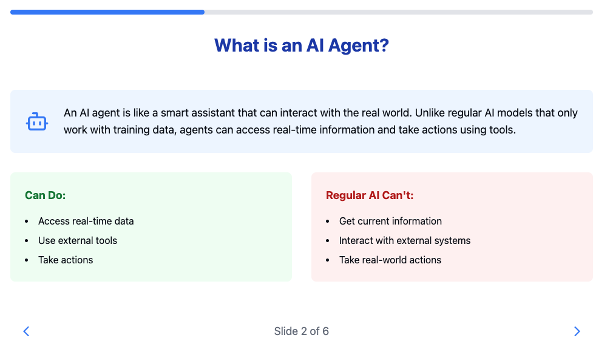

# Day 3 - Gemini API & Langgraph - Agents

## Overview

Day 3 focuses on implementing function calling and building intelligent agents using the Gemini API and Langgraph library. The lessons demonstrate how to create sophisticated conversational AI systems through practical examples.

## Notebooks

This day includes three main notebooks:

1. **Function Calling with Gemini API** (`day-3-function-calling-with-the-gemini-api.ipynb`)

   - Shows how to implement automatic function calling
   - Creates a chat interface over a local database
   - Demonstrates SQL query generation and database interaction
   - Includes examples of stateful conversations

2. **Building an Agent with LangGraph** (`day-3-building-an-agent-with-langgraph.ipynb`)
   - Creates a simulated cafe ordering system (BaristaBot)
   - Demonstrates stateful graph-based applications
   - Shows how to handle user interactions and maintain conversation context
   - Implements a complete ordering system with menu management

## Key Concepts Covered

### Function Calling

- Automatic and manual function calling
- Tool definition and implementation
- Function response handling

### LangGraph

- Graph structure and state management
- Node definitions and transitions
- Conditional edges and routing
- State propagation through graphs
- Conversation state management

### Database Integration

- SQLite database setup and querying
- Schema manipulation
- Query generation through natural language
- Result processing and presentation

## Documentation & Learning

- [Agents](https://www.kaggle.com/whitepaper-agents) This whitepaper has been summarized and turned into Claude artifact. Recommended to read before reading the whitepaper: https://claude.site/artifacts/f6fd85c4-a95e-44ad-a76c-f9979b593481

  { width=50% }

- Go through this notebook also before starting with exercise: **Introduction to LangGraph** (`introduction_to_langgraph.ipynb`)

  - Provides foundational concepts of LangGraph
  - Includes basic examples of graph construction
  - Demonstrates integration with weather API
  - Shows how to build conditional workflows

- [LangGraph Conceptual Guides](https://langchain-ai.github.io/langgraph/concepts/)
- [Function Calling Cookbook](https://github.com/google-gemini/cookbook/blob/main/quickstarts/Function_calling.ipynb)
- [Gemini API Documentation](https://ai.google.dev/gemini-api/docs/api-key)
