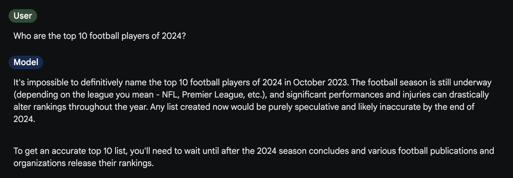
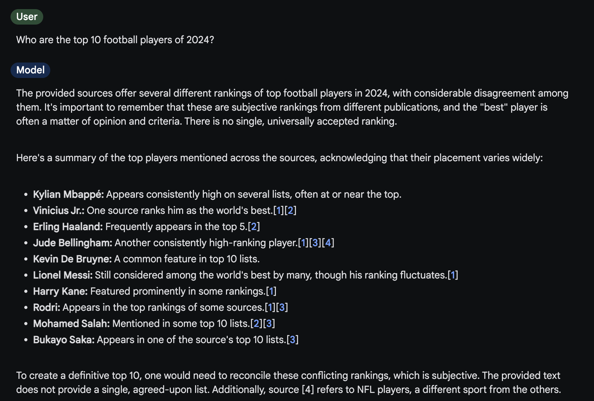
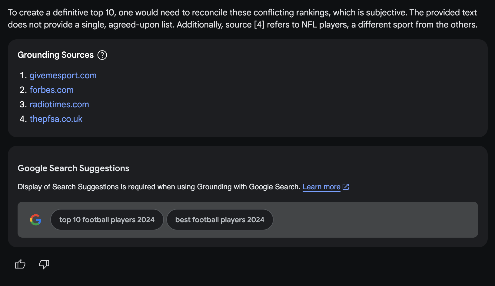
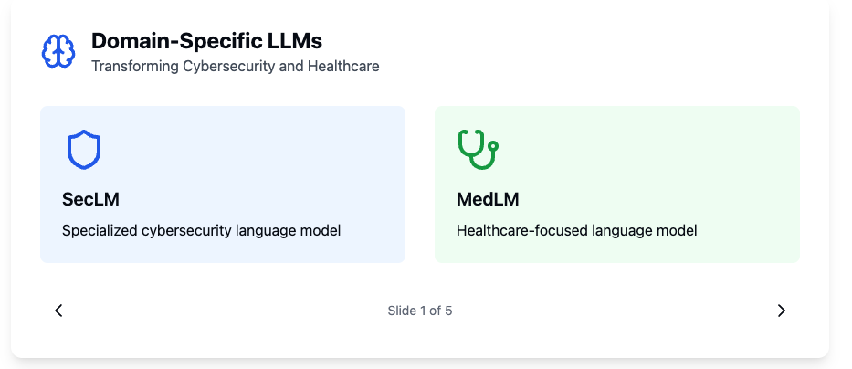

# Day 4 - Domain Specific Large Language Models offered by Google

This repository contains two key implementations demonstrating advanced techniques using the Gemini API:

1. Google Search Grounding
2. Fine-tuning Custom Models

## 1. Google Search Grounding with Gemini API

### Overview

Grounding is a technique that connects the AI model to verifiable sources of information through Google Search results. The implementation offers two approaches:

1. Through Google AI Studio (no charge)
2. Through the API (requires billing)

### Features

#### Search Grounding

- Automatically generates Google Search queries
- Retrieves relevant data from Google's web index
- Provides links to search suggestions that support the query
- Allows users to verify sources
- Similar to RAG (Retrieval-Augmented Generation) but with automated processes

#### Types of Grounding

##### Static Grounding

- Explicitly enables search grounding for all queries
- Uses the `google_search_retrieval` tool
- Provides metadata including:
  - Links to search suggestions
  - Supporting documents
  - Information on how supporting documents were used
  - Grounding chunks with source URIs

##### Dynamic Grounding

- Automatically determines when to use search grounding
- Uses a probability threshold to decide when to retrieve search results
- Configuration options:
  - `dynamic_retrieval_config`
  - `mode`: "MODE_DYNAMIC"
  - `dynamic_threshold`: Value between 0 and 1 (e.g., 0.5)
- Calculates likelihood that a response needs search backing

Run the notebook to get better understanding: `day-4-google-search-grounding.ipynb`

### Experiments done in Google AI Studio

We have prompted with Gemini-1.5 on before and after grounding for the query: ``:

**Before Grounding**

{ width=75% }

**After Grounding**

{ width=75% }
{ width=75% }

## 2. Fine-tuning Custom Models

### Overview

Fine-tuning allows you to create specialized models for specific tasks such as:

- Entity extraction
- Summarization
- Stylized generation
- Text classification

### Implementation Methods

In this exercise, we will be fine tuning the model for text classification task. Go through the notebook: `day-4-fine-tuning-a-custom-model.ipynb`.

### Fine-tuning Process

#### Data Preparation

- Preprocesses input data to remove unnecessary information
- Normalizes text format
- Samples data (50 rows per category for training)
- Uses parameter-efficient fine-tuning (PEFT)
- Requires fewer training examples compared to traditional methods

#### Model Tuning Parameters

- `epoch_count`: Number of times to loop through the data
- `batch_size`: Number of rows to process in a single step
- `learning_rate`: Scaling factor for updating model weights
- Supports Pandas dataframes as input
- Requires specifying input and output columns

### Advantages

1. Efficient Training

   - Updates relatively small number of parameters
   - Does not require training a new model
   - No need to update the large model

2. Performance Benefits

   - No prompting or system instructions needed
   - Outputs succinct text from provided classes
   - Improved accuracy compared to baseline

3. Token Efficiency
   - Reduces input token count
   - Produces more concise outputs
   - Potentially lower costs in production

## Requirements for Both Techniques

- Python environment
- Google GenerativeAI Python SDK (version >=0.8.3)
- Gemini API key
- For Search Grounding: Compatible with "-002" series models
- For Fine-tuning: Access to models supporting `createTunedModel` method

## Cost Considerations

### Search Grounding

- Requires billing for API usage
- Free trial available in AI Studio

### Fine-tuning

- Model tuning is provided at no cost through AI Studio and Gemini API
- Normal limits and charges apply for using the tuned model
- Costs depend on:
  - Input prompt size
  - Generation config
  - System instructions
  - Number of generated output tokens

## Best Practices

1. For Search Grounding:

   - Follow specific requirements for showing search suggestions
   - Use grounding links appropriately
   - Implement search suggestions as per guidelines

2. For Fine-tuning:
   - Evaluate baseline performance before tuning
   - Use appropriate preprocessing for your data
   - Monitor tuning progress through loss curves
   - Compare token usage and model performance
   - Test with custom data after tuning

## Note

- Fine-tuning jobs are queued and can take 20+ minutes depending on dataset size and infrastructure availability
- When using search grounding, follow the requirements in the official documentation
- For implementation details, refer to the respective script documentation and official Gemini API guides

## Documentation & Reading

- Its highly recommended to [read the whitepaper](https://www.kaggle.com/whitepaper-solving-domains-specific-problems-using-llms) which provides comprehensive background on:

  - Domain-specific applications of LLMs
  - Detailed case studies in cybersecurity (SecLM) and healthcare (MedLM)
  - Technical approaches and evaluation methodologies
  - Implementation considerations and best practices

- To further get comfortably to start with whitepaper, also distilled down the whitepaper with help of Claude: https://claude.site/artifacts/4ef4f9db-cdc0-486c-9de3-7d38781f20a0

  

- Recommended to read [When to use supervised fine-tuning for Gemini](https://cloud.google.com/blog/products/ai-machine-learning/supervised-fine-tuning-for-gemini-llm)
