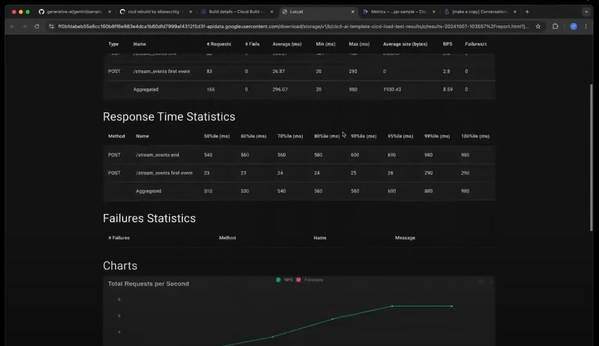

# Day 5 - MLOps for Generative AI

There is no code lab on Day 5. We will just go through the demonstration of the [Starter Pack](https://github.com/GoogleCloudPlatform/generative-ai/tree/main/gemini/sample-apps/e2e-gen-ai-app-starter-pack), a resource for reducing time to production and providing an example on how to build production-ready GenAI applications while implementing practices from the white paper.

## Why create the Starter Pack?

- Prototyping is usually easy; _getting to production is the tricky part_.
- Existing challenges in bringing GenAI applications to production:

  - **Deployment and Operations:** Building infrastructure, testing, deployment, UI development.
  - **Evaluation:** Measuring performance, building synthetic data.
  - **Customization:** Integrating custom logic, implementing security and compliance.
  - **Observability:** Collecting data for tuning and evaluation, monitoring the service and user feedback.

  { width=70% }

## What does the Starter Pack offer?

- A production-ready FastAPI server: Enables a real-time chat interface, event streaming, and auto-generation of docs.
- A UI playground for experimentation.
- All the CI/CD Terraform needed for quick deployment.
- Different patterns for building agents or RAG applications.
- Showcases how to achieve observability by tracking user interactions with the application.

  { width=70% }

## Code Walkthrough and Live Demo:

1. Clone the repo in your preferred directory and change directory to `e2e-gen-ai-app-starter-pack` folder:

   ```bash
   git clone https://github.com/GoogleCloudPlatform/generative-ai.git
   cd e2e-gen-ai-app-starter-pack
   ```

2. Install all the required dependencies.

3. The architecture uses different Google Cloud components: Cloud Run, Vertex AI Model Garden, Vertex AI Evaluation, BigQuery, etc.

## IDE Demonstration:

1. Running the Playground:

   - The Starter Pack provides a Streamlit UI for testing the application.
   - Elia demonstrates asking a question and the model (Gemini) responding with a recipe.

2. Code Explanation:

   - The application folder contains the server powering the application.
   - The application is built using the LangChain framework.
   - Example: An application that acts as a culinary assistant specializing in providing cooking recipes.

3. Patterns:

   - The Starter Pack provides patterns for building agents (e.g., with LangGraph) and custom RAG Q&A applications.

4. Evaluation:

   - Before going to production, evaluation is crucial.
   - The Starter Pack provides examples for evaluation.

5. Deployment:

- Tools like Terraform and Cloud Build are used to deploy the CI/CD to production.
- Deployment Workflow:
    - Make a commit using Git.
    - Commit lands in the Git provider for approval.
    - Perform unit tests and integration tests.
    - Merge into the main branch.
    - Run tests before deploying (e.g., container building, latency).
    { width=70% }
    - The Starter Pack can auto-generate metrics like minimum/maximum latency and throughput.
    { width=70% }
    - Click "Deployment to Production" for the final application.

6. Testing in Production:

    - Elia replaces the URL in the Streamlit UI with the production URL to test the deployed endpoint.

7. Observability:

    - The Starter Pack ensures all user interactions are logged and saved in BigQuery.
    - A Looker Studio dashboard is provided for monitoring application usage, including conversation count, feedback, and score over time.
    { width=70% }
    - Zoom in on individual conversations to understand each specific data point of human-AI interaction. 
    { width=70% }

## Documentation & Reading

- Its highly recommended to [read the whitepaper](https://www.kaggle.com/whitepaper-operationalizing-generative-ai-on-vertex-ai-using-mlops)
- To further get comfortably to start with whitepaper, also distilled down the whitepaper with help of Claude: https://claude.site/artifacts/418163e8-efde-4efa-acc0-89a6e88c4f66
    { width=70% }
- Lifecycle of a GenAI System: https://claude.site/artifacts/2a9da3d5-9707-4d87-be1f-8569f79f8293 
    { width=70% }
- Key Suggestions for GenAI System Evaluation: https://claude.site/artifacts/b499803d-d61a-4a44-9724-aee569f9e93a
    { width=70% }
- Deployment, packaging, and serving checklist: https://claude.site/artifacts/acc94459-4213-4ca4-ae89-fa9831c15a24
    { width=70% }
- [Day 5 Livestream with Paige Bailey – 5-Day Gen AI Intensive Course](https://youtu.be/uCFW0i9xrBc)